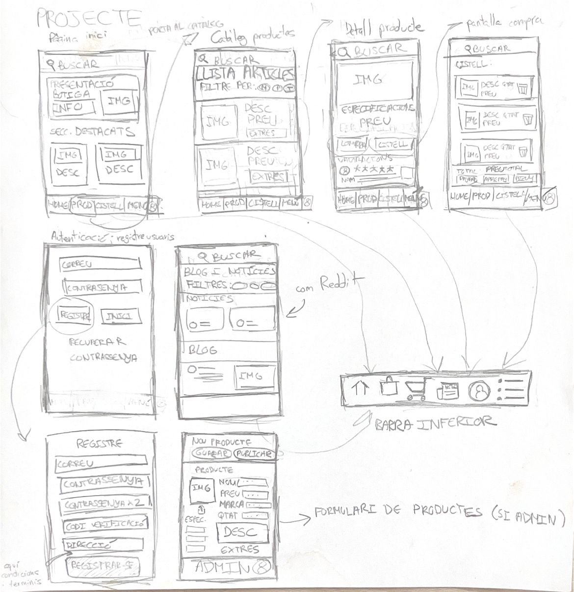

# P0_wireframe
22/10/2024
He començat a plantejar els dibuixos per a la wireframe de l'app per al mòvil, mirant les webs que s'han proporcionat i basant-me
en un exercici d'una altra assignatura que era bastant similar.

23/10/2024
He fet els esbossos bruts de totes les pantalles de l'aplicació móvil en un full.
És una mica caòtic, però penso que s'entén la idea general de què és i fa cada cosa.
Aquí la imatge:
