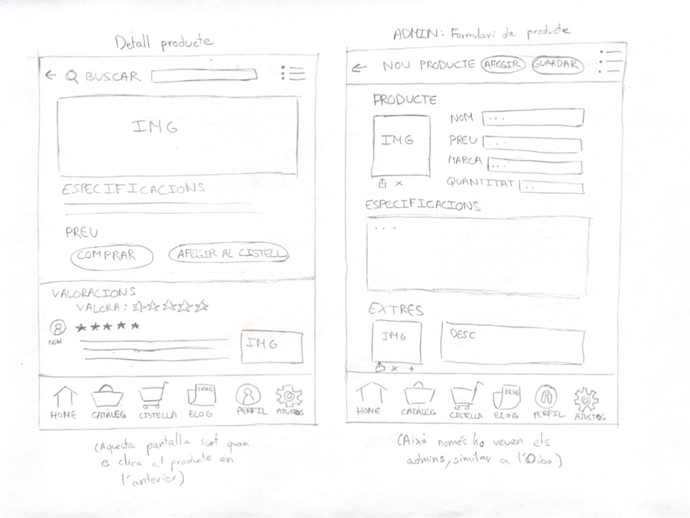

# P0_wireframe
22/10/2024
He començat a plantejar els dibuixos per a la wireframe de l'app per al mòvil, mirant les webs que s'han proporcionat i basant-me
en un exercici d'una altra assignatura que era bastant similar.

23/10/2024
He fet els esbossos bruts de totes les pantalles de l'aplicació móvil en un full.
És una mica caòtic, però penso que s'entén la idea general de què és i fa cada cosa.
Aquí la imatge:

24/10/2024
He aconseguit fer totes les pantalles que se'm demanaven.
Aquí hi són:

1) Pantalla d'inici i pantalla de catàleg de productes:

Pantalla d'inici: Com es pot veure a l'imatge, la pàgina d'inici té la secció de presentació de la botiga i secció de destacats.
Pantalla de catàleg: Mostra els articles, amb una opció per fer filtratge per marca, preu i tipus, 
i els articles amb la seva imatge, descripció, preu i extres.

2) Pantalla de detall del producte i pantalla de formulari de producte (ADMIN):

Pantalla de detall: Mostra la imatge del producte i a sota les seves especificacions i preu. 
Just a sota hi ha l'opció de comprar o afegir al cistell, i a sota d'això les valoracions dels clients sobre el producte.
Pantalla de formulari: L'administrador té aquesta pantalla per a poder afegir un producte, on hi ha la informació que ha de tenir un
producte per posar-lo a la venta, és a dir, seccions per a que l'admin introdueïxi la foto, la descripció, el preu, ...

3) Pantalla de compra i pantalla d'autenticació i registre d'usuaris:

Pantalla de compra: Es mostra els articles que s'han afegit a la cistella, on cada article té una icona de paperera per si el client vol
descartar l'article, i a sota, mostra el preu total i les opcions de pagament (PayPal, Apple Pay o Bizum).
Pantalla d'autenticació: Mostra l'icona de l'aplicació i a sota els requadres per a que l'usuari introdueïxi el seu correu i contrassenya,
i quan ho ha introduït li clica al botó d'iniciar sessió. Si l'usuari no té compte, l'ha de clicar al botó de registrar-se, i si a l'usuari
se l'hi ha oblidat la contrassenya, li ha de clicar al botó de canviar contrassenya.

4) Pantalla de registre i pantalla de blog i notícies:

Pantalla de registe: És la pantalla que apareix quan l'usuari clica al botó de registrar-se en la pantalla anterior. Apareix el logo de
l'app i els camps que ha d'omplir i clicar al botó d'acceptar les condicions, i llavors clica al botó de registrar-se i ja està registrat.
Pantalla de blog i notícies: Mostra notícies i un blog per als usuaris, on a la part superior hi ha una opció per filtrar per diferents
tipus de publicacions o notícies.

NOTA: Quasi totes les pantalles tenen a la part superior la barra de buscar i el menú (el menú son les tres línies amb punts), només els
hi falta a la pantalla d'autenticació i a la pantalla de registre d'usuaris.